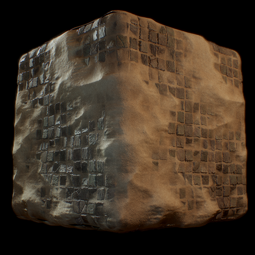

# Procedural Materials

This is a collection of procedural textures made in Substance Designer and rendered in Marmoset Toolbag, with a roughness-metallic Cook-Torrance shader model.

These substance graphs have been cleaned up and organized into logical blocks for anyone to read and incorporate techniques into their own work.

I will probably revisit this repo with more materials since they're super fun to make.

# Usage

Go to Clone or Download > Download as ZIP.

Use this with Creative Commons rules for license: Attribution-NonCommercial CC BY-NC 

Do:
- Use these to learn about substance designer or proceduralism
- Remix, build, tweak, use. Non-commercially, of course.
- Cite/attribute this work if you use very large portions of these materials. 

Don't:
- Sell anything from here.